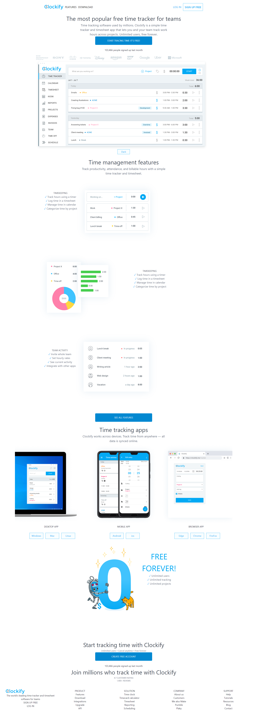
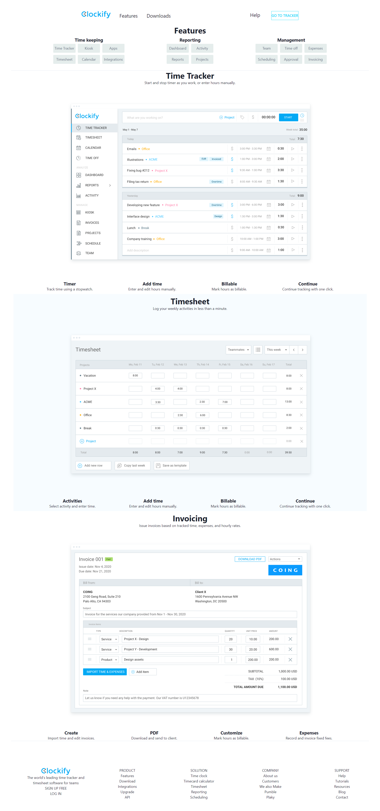
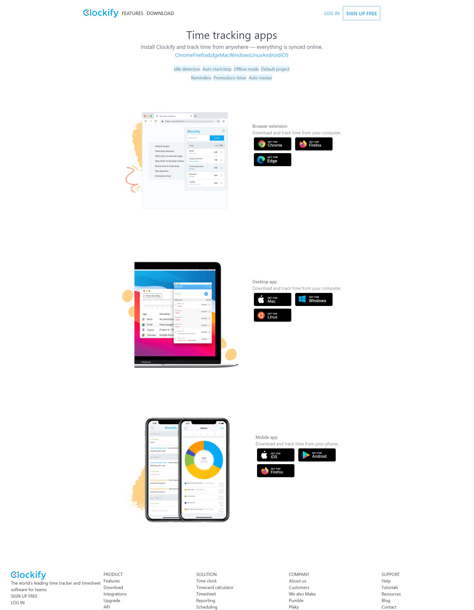
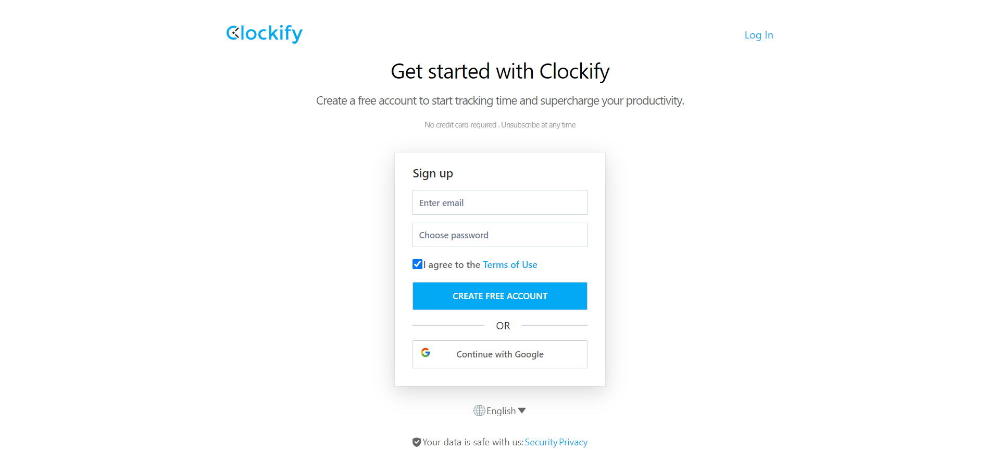
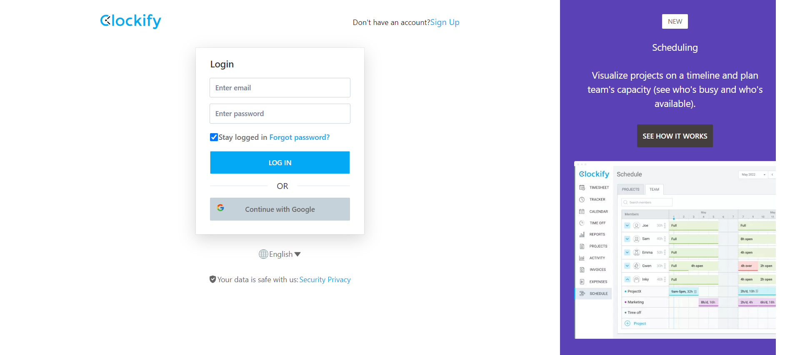

# Clockify Clone Project
Masai Construct Week Project Unit 6.  
Clockify is a time tracker and timesheet app that lets you track work hours across projects.

#Live Demo
https://clokify.netlify.app

# Team Members
•	Arvind Maurya  
•	Mukul Ramdev  
•	Pritesh Patil  
•	Harshini Usarthi  

# Technology Used
•	JSX  
•	CSS  
•	React  
• Redux

# Tools
•	VS Code  
•	Github

# Website Preview
•	Landing Page 
 
   
•	Features Page  

   
•	Downloads Page  

   
•	Sign Up  

   
•	Login  

   

   
# Thank You

